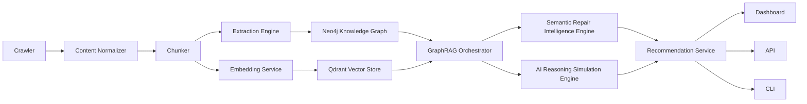

# Engineering Specification: AI Search Intelligence and Semantic Repair Platform

Status: Draft v1  
Date: 2026-07-02  
Audience: engineering, product, data science, AI infrastructure, growth, and operations

## 1. Executive Summary

This document specifies an AI search intelligence platform that crawls websites, builds semantic and graph representations of their content, simulates how modern AI answer engines reason over that content, and recommends repairs that increase visibility, citation probability, topical authority, and competitive position.

The platform combines:

- A crawler and content normalization pipeline.
- A chunking and extraction layer powered by deterministic parsers and LLM-assisted enrichment.
- A Neo4j knowledge graph for entities, topics, pages, claims, competitors, citations, and relationships.
- A Qdrant vector store for semantic retrieval and expansion.
- A GraphRAG layer that uses both graph traversal and embedding similarity.
- A Semantic Repair Intelligence Engine that identifies missing, weak, contradictory, orphaned, or under-supported content relationships.
- An AI Reasoning Simulation Engine that models how ChatGPT, Gemini, Claude, Google AI Mode, and similar answer engines may interpret, compare, cite, or ignore a brand.
- A dashboard, API, and CLI for analysis, recommendations, workflows, and acceptance testing.

The system is not just an SEO crawler. It is designed to answer a more modern question:

> When an AI system tries to understand this brand, website, product, market, or competitor set, what will it believe, what will it cite, what will it compare, and what should we repair first?

## 2. Product Vision

### 2.1 Problem

Search is shifting from ranked pages to generated answers. Brands no longer compete only for blue-link rankings; they compete for inclusion, interpretation, trust, and citation inside AI-generated responses.

Traditional SEO tooling is incomplete for this new environment because it usually focuses on:

- Keywords rather than claims.
- Page-level ranking rather than model-level reasoning.
- Backlinks rather than semantic authority.
- Technical crawl errors rather than answer-engine comprehension.
- Competitor pages rather than competitor narratives.

Modern AI answer engines construct responses from overlapping signals: entities, context, topical coverage, structured data, citations, passage clarity, trust signals, relationship density, and external corroboration. The platform specified here exists to measure and improve those signals.

### 2.2 Objectives

The platform must:

- Crawl and normalize target websites and relevant competitor/reference sources.
- Convert content into pages, sections, chunks, claims, entities, topics, relationships, and embeddings.
- Build a queryable knowledge graph and vector index.
- Detect semantic gaps and relationship weaknesses across a website or content corpus.
- Simulate AI answer behavior across multiple model profiles.
- Estimate citation likelihood, competitor mention likelihood, confidence propagation, and answer inclusion.
- Recommend prioritized repairs with expected impact, effort, risk, and ROI.
- Provide transparent evidence for every recommendation.
- Support repeatable scans, longitudinal tracking, and acceptance tests.

### 2.3 Non-Goals

The first production release will not:

- Guarantee exact behavior of proprietary third-party AI systems.
- Automatically publish website changes without human approval.
- Replace editorial judgment or legal/compliance review.
- Depend on one LLM provider for all reasoning.
- Treat semantic repair as traditional keyword stuffing.
- Store private customer data unless explicitly configured and protected.

## 3. System Overview

### 3.1 Core Workflow

1. Create a project for a target website, brand, product, or content corpus.
2. Configure crawl scope, competitors, priority topics, seed queries, and business goals.
3. Crawl and ingest pages.
4. Normalize HTML into structured page, section, and chunk records.
5. Extract entities, topics, claims, schema, citations, and relationships.
6. Generate embeddings and store chunks in Qdrant.
7. Build or update the Neo4j knowledge graph.
8. Run GraphRAG analysis over queries, pages, topics, and competitor contexts.
9. Run semantic repair analysis.
10. Run AI reasoning simulations across model profiles.
11. Generate prioritized recommendations.
12. Review recommendations in dashboard, API, or CLI.
13. Export tasks, briefs, or implementation tickets.
14. Re-crawl and validate improvements.

### 3.2 High-Level Architecture



## 4. Volume 1: Vision, Objectives, Architecture, Stack, Repositories, Workflows

### 4.1 User Personas

Primary users:

- Growth teams that need to improve visibility in AI answers.
- SEO teams evolving from keyword ranking to semantic authority.
- Content strategists planning topical coverage and authority.
- Founders and product marketers comparing their positioning against competitors.
- Agencies managing multi-client AI-search optimization programs.

Secondary users:

- Engineers integrating analysis into internal tools.
- Data scientists tuning scoring models.
- Editors executing repair recommendations.
- Executives reviewing market visibility trends.

### 4.2 Key Product Capabilities

The product must support:

- Project setup and crawl configuration.
- Website and competitor corpus ingestion.
- Content graph construction.
- Semantic gap detection.
- Claim-level and entity-level analysis.
- AI answer simulation.
- Competitor comparison.
- Prioritized repair planning.
- Evidence-backed recommendations.
- Before/after tracking.
- Exports to Markdown, CSV, JSON, PDF, and task systems.

### 4.3 Recommended Technology Stack

Frontend:

- React or Next.js for dashboard.
- TypeScript for frontend safety.
- TanStack Query for server state.
- Lightweight charting library for trends and score breakdowns.

Backend:

- Python FastAPI for API services and AI/data workflows.
- Celery, Dramatiq, or Temporal for background jobs.
- PostgreSQL for relational metadata, projects, users, scans, and audit records.
- Neo4j for knowledge graph.
- Qdrant for vector search.
- Redis for queues, cache, locks, and rate limiting.

AI and retrieval:

- DeepSeek for cost-efficient structured extraction and reasoning tasks where appropriate.
- Provider abstraction for OpenAI, Anthropic, Google, DeepSeek, and local models.
- GraphRAG orchestration layer with pluggable retrieval strategies.

Infrastructure:

- Docker Compose for local development.
- Kubernetes or managed container services for production.
- Object storage for crawl artifacts, HTML snapshots, screenshots, and exports.
- OpenTelemetry for traces, metrics, and logs.

### 4.4 Repository Structure

Recommended monorepo:

```text
apps/
  web-dashboard/
  api/
  worker/
packages/
  crawler/
  content-normalizer/
  chunker/
  extraction/
  graph/
  vector/
  graphrag/
  repair-engine/
  simulation-engine/
  scoring/
  shared/
infra/
  docker/
  k8s/
  terraform/
docs/
  engineering-spec.md
  architecture/
  api/
  ontology/
  runbooks/
tests/
  fixtures/
  acceptance/
```

### 4.5 Development Workflow

Every feature should include:

- A short design note for behavioral changes.
- Unit tests for deterministic logic.
- Integration tests for service boundaries.
- Fixture-based tests for crawler, chunker, graph writes, and vector retrieval.
- Acceptance tests for high-value workflows.
- Observability events for new long-running jobs.

Pull requests should include:

- User-facing behavior summary.
- Migration notes, if applicable.
- Test evidence.
- Known limitations.
- Rollback plan for risky changes.

## 5. Volume 2: Detailed System Architecture

### 5.1 Crawler

The crawler discovers, fetches, snapshots, and schedules pages.

Required capabilities:

- Respect robots.txt unless project configuration explicitly allows controlled override for owned domains.
- Support sitemap ingestion.
- Support seed URLs and crawl depth limits.
- Detect canonical URLs.
- Capture HTTP status, redirects, headers, content type, response time, and final URL.
- Store raw HTML snapshots.
- Extract outgoing links, internal links, media references, structured data, and metadata.
- Apply crawl budgets and per-domain rate limits.

Crawler output:

```json
{
  "url": "https://example.com/product",
  "canonical_url": "https://example.com/product",
  "status_code": 200,
  "content_type": "text/html",
  "html_snapshot_uri": "s3://bucket/snapshots/scan/page.html",
  "fetched_at": "2026-07-02T00:00:00Z",
  "links": [],
  "metadata": {}
}
```

### 5.2 Content Normalizer

The normalizer converts raw HTML into clean structured content.

Responsibilities:

- Remove navigation, cookie banners, repeated boilerplate, and irrelevant scripts.
- Preserve headings, sections, tables, lists, FAQs, schema, and citations.
- Build a document outline from heading hierarchy.
- Compute readability and clarity metrics.
- Detect duplicate or near-duplicate sections.
- Preserve source offsets for traceability.

### 5.3 Chunker

The chunker splits normalized content into retrievable units.

Chunk types:

- Page summary chunk.
- Section chunk.
- Paragraph chunk.
- Table chunk.
- FAQ chunk.
- Claim chunk.
- Schema chunk.

Chunking rules:

- Prefer semantic boundaries over arbitrary token windows.
- Preserve parent page and parent section references.
- Include neighboring context for isolated chunks.
- Keep stable chunk IDs across scans when content has not materially changed.
- Track chunk quality, length, density, and ambiguity.

### 5.4 DeepSeek-Assisted Extraction

DeepSeek or another configured LLM may be used for:

- Entity extraction.
- Topic classification.
- Claim extraction.
- Relationship inference.
- Intent mapping.
- Page purpose classification.
- Competitor comparison extraction.
- Repair recommendation drafting.

LLM outputs must be validated against schemas. Invalid outputs should be retried, repaired, or rejected.

### 5.5 Neo4j

Neo4j stores durable semantic relationships.

Primary uses:

- Entity-topic-page relationships.
- Page hierarchy and internal links.
- Claim support and contradiction.
- Competitor relationships.
- Citation and source graphs.
- Repair opportunity graphs.
- Authority and centrality calculations.

### 5.6 Qdrant

Qdrant stores embeddings for semantic search.

Collections:

- `page_chunks`
- `claims`
- `entities`
- `topics`
- `queries`
- `competitor_passages`
- `repair_candidates`

Each vector record must include:

- Stable ID.
- Project ID.
- Scan ID.
- Source URL.
- Chunk type.
- Text hash.
- Metadata needed for filtering.

### 5.7 GraphRAG Layer

GraphRAG combines vector similarity with graph traversal.

Retrieval strategies:

- Query-to-chunk vector search.
- Topic-to-page graph expansion.
- Entity-neighborhood traversal.
- Claim support retrieval.
- Competitor contrast retrieval.
- Citation source retrieval.
- Weak relationship discovery.

The GraphRAG layer returns evidence bundles, not only text passages.

Evidence bundle:

```json
{
  "query": "best customer support automation software",
  "chunks": [],
  "entities": [],
  "topics": [],
  "claims": [],
  "paths": [],
  "scores": {
    "semantic_relevance": 0.82,
    "graph_authority": 0.71,
    "citation_strength": 0.56
  }
}
```

### 5.8 Hermes Orchestration Layer

Hermes is the internal orchestration layer responsible for routing analysis jobs and coordinating multi-step reasoning workflows.

Responsibilities:

- Dispatch long-running scans.
- Coordinate crawler, extraction, graph, vector, repair, and simulation jobs.
- Enforce job idempotency.
- Track job state and retries.
- Store intermediate artifacts.
- Route model calls through provider adapters.
- Emit progress events to dashboard and API clients.

Hermes should treat every workflow as a resumable job graph.

## 6. Volume 3: Knowledge Graph Ontology

### 6.1 Node Types

Core nodes:

- `Project`
- `Scan`
- `Domain`
- `Page`
- `Section`
- `Chunk`
- `Entity`
- `Topic`
- `Claim`
- `Query`
- `Intent`
- `Competitor`
- `Product`
- `Feature`
- `Audience`
- `Citation`
- `Source`
- `SchemaMarkup`
- `RepairRecommendation`
- `SimulationRun`
- `ModelProfile`

### 6.2 Relationship Types

Core relationships:

- `BELONGS_TO`
- `PART_OF`
- `LINKS_TO`
- `MENTIONS`
- `ABOUT`
- `SUPPORTS`
- `CONTRADICTS`
- `CITES`
- `COMPETES_WITH`
- `TARGETS_INTENT`
- `HAS_FEATURE`
- `HAS_AUDIENCE`
- `HAS_SCHEMA`
- `RETRIEVED_FOR`
- `RECOMMENDS_REPAIR`
- `IMPROVES`
- `WEAKLY_SUPPORTS`
- `MISSING_SUPPORT_FOR`
- `SEMANTICALLY_NEAR`

### 6.3 Example Cypher Constraints

```cypher
CREATE CONSTRAINT project_id IF NOT EXISTS
FOR (p:Project) REQUIRE p.id IS UNIQUE;

CREATE CONSTRAINT scan_id IF NOT EXISTS
FOR (s:Scan) REQUIRE s.id IS UNIQUE;

CREATE CONSTRAINT page_id IF NOT EXISTS
FOR (p:Page) REQUIRE p.id IS UNIQUE;

CREATE CONSTRAINT chunk_id IF NOT EXISTS
FOR (c:Chunk) REQUIRE c.id IS UNIQUE;

CREATE CONSTRAINT entity_key IF NOT EXISTS
FOR (e:Entity) REQUIRE e.key IS UNIQUE;

CREATE CONSTRAINT claim_id IF NOT EXISTS
FOR (c:Claim) REQUIRE c.id IS UNIQUE;
```

### 6.4 Scoring Dimensions

Each graph relationship may include:

- `confidence`
- `source`
- `method`
- `scan_id`
- `created_at`
- `evidence_count`
- `strength`
- `decay`
- `directionality`

Scores should be recalculable from stored evidence.

### 6.5 Graph Algorithms

Required algorithms:

- PageRank for internal authority.
- Community detection for topic clusters.
- Shortest path for relationship explainability.
- Similarity scoring for entity and topic overlap.
- Centrality analysis for key pages and claims.
- Link gap detection for orphaned or under-connected content.

## 7. Volume 4: Semantic Repair Intelligence Engine

### 7.1 Purpose

The Semantic Repair Intelligence Engine identifies content and graph repairs that improve AI comprehension, retrieval, confidence, and citation probability.

It should not simply say "add more keywords." It should explain what relationship, claim, topic, entity, page, section, schema, or citation is weak and how to fix it.

### 7.2 Repair Types

Relationship repairs:

- Add internal links between semantically related pages.
- Strengthen weak entity-topic relationships.
- Connect orphan pages to topic hubs.
- Add support pages for unsupported claims.

Page repairs:

- Clarify page purpose.
- Improve title and heading alignment.
- Add missing definitions.
- Add product/category context.
- Add comparison sections.
- Add structured FAQ sections.
- Add schema markup.

Section repairs:

- Add direct answers to likely AI queries.
- Split overloaded sections.
- Add citations or evidence.
- Resolve contradictions.
- Improve entity specificity.

Claim repairs:

- Support claims with evidence.
- Rewrite vague claims into verifiable statements.
- Remove or flag unsupported claims.
- Add source references.

Competitor repairs:

- Add competitor comparison pages.
- Fill feature comparison gaps.
- Improve positioning around known competitor strengths.
- Add proof for differentiated claims.

### 7.3 Prioritization Formula

Each recommendation receives:

- Impact score.
- Confidence score.
- Effort score.
- Risk score.
- Strategic importance score.
- Estimated citation lift.
- Estimated conversion or business value.

Suggested priority score:

```text
priority = ((impact * confidence * strategic_importance) + citation_lift + business_value)
           / max(effort + risk, 1)
```

### 7.4 Predictive Simulation

Before recommending a repair, the system should simulate expected effects:

- New graph paths created.
- Retrieval relevance changes.
- Topic authority changes.
- Claim support changes.
- Citation probability changes.
- Competitor comparison changes.

### 7.5 Recommendation Output

```json
{
  "id": "repair_123",
  "type": "claim_support_repair",
  "title": "Add evidence for automation ROI claim",
  "target_url": "https://example.com/platform",
  "problem": "The page claims 40 percent time savings but no supporting source is connected.",
  "recommended_action": "Add a short proof section with methodology, customer example, or linked case study.",
  "expected_impact": {
    "citation_probability_lift": 0.12,
    "confidence_lift": 0.18
  },
  "evidence": [],
  "priority": 84
}
```

## 8. Volume 5: AI Reasoning Simulation Engine

### 8.1 Purpose

The AI Reasoning Simulation Engine estimates how answer engines may interpret a website, brand, product, competitor, or topic.

It does this through model profiles, prompt templates, evidence retrieval, chain analysis, citation probability scoring, confidence propagation, and competitor comparison.

### 8.2 Model Profiles

Initial profiles:

- ChatGPT-style answer engine.
- Gemini-style answer engine.
- Claude-style answer engine.
- Google AI Mode-style answer engine.
- Generic RAG search assistant.

Each profile should define:

- Retrieval breadth.
- Citation conservatism.
- Preference for concise or comprehensive answers.
- Sensitivity to source authority.
- Sensitivity to structured data.
- Competitor comparison behavior.
- Confidence threshold.

### 8.3 Simulation Modes

Modes:

- Brand inclusion simulation.
- Citation probability simulation.
- Competitor comparison simulation.
- Query answer simulation.
- Confidence propagation simulation.
- Claim verification simulation.
- Market narrative simulation.

### 8.4 Confidence Propagation

Confidence should propagate through:

- Source authority.
- Claim support.
- Entity clarity.
- Topic coverage.
- Internal consistency.
- External corroboration.
- Retrieval rank.
- Passage specificity.

Low-confidence passages should reduce citation probability even when semantically relevant.

### 8.5 Citation Probability

Citation probability should account for:

- Passage relevance.
- Source authority.
- Claim specificity.
- Presence of evidence.
- Freshness.
- Schema markup.
- Internal link support.
- External citation support.
- Competitor source strength.
- Query intent match.

### 8.6 Competitor Comparison

The engine must compare:

- Feature coverage.
- Pricing and packaging visibility.
- Use-case clarity.
- Proof density.
- Review and citation availability.
- Category authority.
- Page depth.
- AI answer inclusion likelihood.

Output should identify why a competitor is likely to be mentioned instead of, before, or alongside the target brand.

## 9. Volume 6: Dashboard, APIs, CLI, Testing, Deployment, Roadmap

### 9.1 Dashboard

Primary views:

- Project overview.
- Crawl status.
- AI visibility score.
- Semantic authority map.
- Topic coverage.
- Competitor comparison.
- Repair recommendations.
- Simulation results.
- Evidence explorer.
- Scan history.
- Export center.

Dashboard requirements:

- Every score must be explainable.
- Every recommendation must include evidence.
- Users must be able to approve, reject, assign, export, and mark repairs complete.
- Long-running jobs must show progress and resumable status.
- Comparison views must support before/after scan deltas.

### 9.2 API

Core endpoints:

```text
POST /projects
GET /projects/{project_id}
POST /projects/{project_id}/scans
GET /scans/{scan_id}
GET /scans/{scan_id}/pages
GET /scans/{scan_id}/topics
GET /scans/{scan_id}/graph
POST /scans/{scan_id}/simulate
GET /scans/{scan_id}/recommendations
POST /recommendations/{recommendation_id}/status
GET /exports/{export_id}
```

API design requirements:

- All long-running operations return job IDs.
- All recommendations return evidence references.
- All scores include version metadata.
- All mutations are audit logged.
- Pagination is required for large collections.

### 9.3 CLI

Example commands:

```text
ai-search init
ai-search scan --project acme --url https://example.com
ai-search competitors add --project acme https://competitor.com
ai-search graph inspect --project acme --topic "customer support automation"
ai-search simulate --project acme --query "best customer support automation software"
ai-search repair list --project acme --priority high
ai-search export --project acme --format markdown
```

### 9.4 Testing Strategy

Unit tests:

- URL normalization.
- HTML parsing.
- Chunk ID stability.
- Scoring formulas.
- Graph relationship construction.
- Recommendation prioritization.

Integration tests:

- Crawl to normalized document.
- Normalized document to chunks.
- Chunks to embeddings.
- Extraction to Neo4j.
- GraphRAG evidence bundle generation.
- Repair recommendation generation.
- Simulation run lifecycle.

Acceptance tests:

- Given a site with an orphan page, the system recommends internal links.
- Given an unsupported claim, the system recommends evidence or removal.
- Given weak competitor coverage, the system recommends comparison content.
- Given a topic cluster gap, the system identifies missing support pages.
- Given a repair and rescan, the relevant score improves or explains why it did not.

### 9.5 Wicked Gud Acceptance Tests

The platform should include a named acceptance suite called Wicked Gud. These tests represent product-quality checks, not only technical correctness.

Wicked Gud tests:

- A user can scan a site and understand the top three repairs within five minutes.
- Every top recommendation includes source evidence and a clear action.
- The same scan run twice on unchanged content produces stable recommendations.
- A content repair changes the graph in a visible, explainable way.
- A competitor comparison explains the reasoning, not only the rank.
- A hallucinated or unsupported claim is flagged before it reaches a recommendation.
- A failed crawl does not corrupt existing project state.

### 9.6 Deployment

Local development:

- Docker Compose with API, worker, web, PostgreSQL, Redis, Neo4j, and Qdrant.

Staging:

- Production-like services.
- Synthetic test sites.
- Fixture competitor corpora.
- Restricted model budgets.

Production:

- Managed PostgreSQL.
- Managed Redis.
- Neo4j Aura or self-managed Neo4j cluster.
- Qdrant Cloud or self-managed Qdrant.
- Object storage.
- Queue workers with autoscaling.
- Observability stack.

### 9.7 Security and Privacy

Requirements:

- Encrypt secrets at rest.
- Never log raw API keys.
- Separate tenant data by project and organization.
- Store crawl snapshots with access controls.
- Provide data deletion workflows.
- Audit all project mutations.
- Support model-provider data controls.
- Allow private crawl credentials only through encrypted vault storage.

### 9.8 Roadmap

Phase 1: Foundation

- Project setup.
- Basic crawler.
- HTML normalization.
- Chunking.
- Qdrant embeddings.
- Neo4j graph creation.
- Basic dashboard.

Phase 2: GraphRAG and Repair

- Evidence bundle retrieval.
- Entity/topic/claim extraction.
- Semantic gap detection.
- Initial repair recommendations.
- CLI and API exports.

Phase 3: AI Reasoning Simulation

- Model profiles.
- Query simulations.
- Citation probability.
- Competitor comparison.
- Confidence propagation.

Phase 4: Production Hardening

- Multi-tenant auth.
- Job orchestration hardening.
- Observability.
- Cost controls.
- Full acceptance suite.
- Export workflows.

Phase 5: Advanced Intelligence

- Predictive repair simulation.
- Automated content briefs.
- External source graph.
- Review/rating integrations.
- Search console and analytics integrations.
- Human-in-the-loop editorial workflows.

## 10. Open Questions

- Should Hermes be a standalone service or an internal module inside the worker application?
- Which model provider should be the default for production extraction?
- Should competitor crawling be opt-in only per domain?
- What is the first target customer segment: agencies, in-house growth teams, or technical founders?
- Which exports matter most first: Markdown briefs, Jira tickets, Linear issues, CSV, or DOCX/PDF?
- What minimum evidence threshold should block a recommendation?
- How much external web evidence should be included in v1?

## 11. Initial Milestone Definition

The first milestone should prove the full loop on one website:

1. Crawl 25 to 100 pages.
2. Normalize and chunk content.
3. Extract entities, topics, and claims.
4. Build Neo4j graph and Qdrant vectors.
5. Run one GraphRAG query.
6. Produce at least five evidence-backed repair recommendations.
7. Run one AI reasoning simulation against one query.
8. Show results in dashboard or CLI.
9. Re-run after a content change and show measurable delta.

This milestone validates the core product promise without requiring the entire advanced simulation suite.

## 12. Definition of Done

The platform is ready for private beta when:

- A user can configure a project without engineering help.
- A scan can complete reliably for a normal marketing website.
- Recommendations are evidence-backed and stable.
- Scores are explainable.
- Failed jobs are recoverable.
- Data can be exported.
- The Wicked Gud acceptance suite passes.
- At least one real repair produces a measurable improvement in semantic graph strength or simulation outcome.
